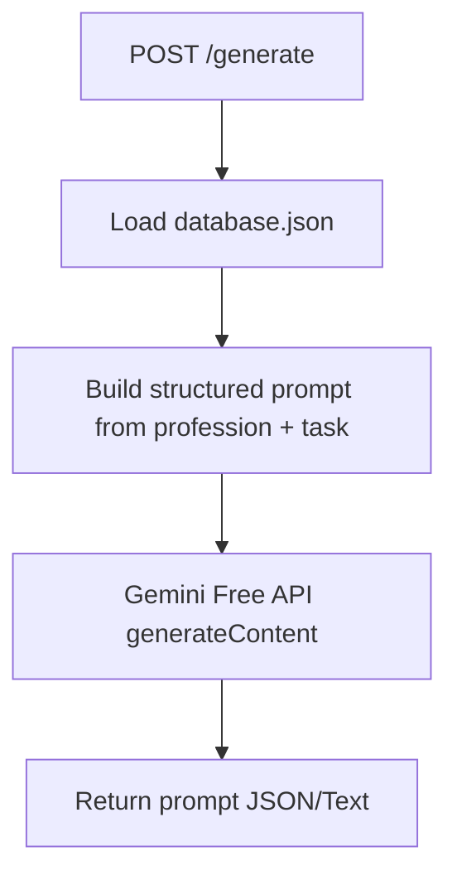

# ⚙️ Root Inside – AI Prompt Automation MVP (Gemini Free API Only)
### 산업/직무별 맞춤 프롬프트 자동 생성 · Google Gemini 무료 API 기반

**이 저장소는 무료 Google Gemini API만으로 실제 동작하는 MVP**입니다.  
법률·세무·컨설팅·마케팅·개발 등 직군별 업무에 맞춰 `database.json`을 읽고,  
**맥락화된 고품질 프롬프트**를 자동으로 생성합니다.

> ✅ 실행 엔진: **Gemini Free API (1.5 Flash/Pro 중 택1)**  
> 🛈 기타 AI(GPT-4o, Claude 등): "추천 모델"로만 문서에 안내 (코드 호출 없음)

---

## 🌐 개요 (Overview)

대부분의 사용자는 매 작업마다 프롬프트를 새로 쓰며 시간을 낭비합니다.  
Root Inside의 MVP는 **직군·정확도·리스크·핵심요건**을 구조화한 `database.json`을 바탕으로,  
**Gemini 무료 API**로 즉시 쓸 수 있는 **산업별 표준 프롬프트**를 자동 생성합니다.

---

## 🧠 핵심 기능 (Core Features)

| 기능 | 설명 |
|---|---|
| 🧩 직군 기반 프롬프트 생성 | `database.json`의 `common_tasks`, `key_requirements`, `required_accuracy`, `risk_level`을 결합해 도메인 특화 프롬프트 자동 생성 |
| 🔒 정확도/리스크 제어 | 고정밀 직군(법률·의료·회계)은 **보수적 모드**로 안전문구·근거요청·불확실성 표기 포함 |
| 📚 프롬프트 자산화 | 생성된 프롬프트를 JSON으로 저장(옵션) → 재사용 가능한 "AI Prompt Asset" |
| 🔁 워크스페이스 연동(선택) | Docs/Sheets/Apps Script로 내보내기 용도의 정형 텍스트 출력 |

> 💡 **추천 AI (문서 안내용)**:  
> - 정확성·장문 분석: Claude / GPT-4o  
> - 창의/카피: GPT-4o  
> - 속도/멀티모달/Google 연동: **Gemini (현재 엔진)**  
> ※ 본 MVP는 **Gemini만 호출**합니다.

---

## 🗂 데이터셋 (`database.json`)

직군별 메타데이터 구조:
- `name`: 직군명 (한글)
- `name_en`: 직군명 (영문)
- `category`: 카테고리
- `common_tasks[]`: 공통 업무 목록
- `required_accuracy`: 요구 정확도 (high/medium/low)
- `risk_level`: 리스크 수준 (high/medium/low)
- `key_requirements[]`: 핵심 요구사항

추가 섹션:
- `ai_models`: AI 모델 설명 및 권장 용도
- `prompt_best_practices`: 프롬프트 작성 베스트 프랙티스

**예시**: `professions.accountant` → 세무 전략·재무제표·세법 등 요구사항을 반영해 프롬프트를 구성.

---

## 🧩 프롬프트 출력 예시 (Accountant)

**입력**:
```json
{
  "profession": "accountant",
  "task": "세무 전략 수립 보고서 초안 작성",
  "language": "ko"
}
```

**생성 예시 (요약)**:
```
[역할] 한국 중소기업 세무 전문가
[목표] 세무 전략 수립 보고서 초안(요약·권고안 분리)
[필수 반영]
  - 재무제표/세무 데이터 기반
  - 최신 세법 기준(불확실 시 명시)
  - 정확성 최우선·추정 금지·출처 표기
[출력 형식]
  1) 서론 2) 주요 이슈 3) 전략 제안 4) 참고 법령/출처
```

---

## 🏗 아키텍처 (MVP)



---

## 🚀 빠른 시작 (Quickstart)

### 1) 사전 준비
- Node.js 18+
- [Google AI Studio](https://aistudio.google.com/)에서 Gemini API Key 발급

### 2) 설치
```bash
npm init -y
npm install express @google/generative-ai dotenv
```

### 3) 환경 변수 설정 (`.env`)
```env
GEMINI_API_KEY=여기에_발급받은_API키_입력
GEMINI_MODEL=gemini-1.5-flash
PORT=8787
```

### 4) 파일 구조
```
.
├─ database.json        # 업로드한 직군/모델/가이드 데이터
├─ server.js            # Express API (POST /generate)
├─ cli.js               # 터미널에서 한 번에 프롬프트 생성
├─ .env
└─ package.json
```

---

## 📦 package.json 설정

`package.json`에 다음 설정을 추가하세요:

```json
{
  "name": "root-inside-prompt-automation",
  "version": "1.0.0",
  "type": "module",
  "scripts": {
    "start": "node server.js",
    "cli": "node cli.js"
  },
  "dependencies": {
    "express": "^4.18.2",
    "@google/generative-ai": "^0.1.3",
    "dotenv": "^16.3.1"
  }
}
```

---

## 🧪 서버 코드 (`server.js`)

```javascript
import 'dotenv/config';
import express from 'express';
import fs from 'fs';
import path from 'path';
import { GoogleGenerativeAI } from '@google/generative-ai';

const app = express();
app.use(express.json());

// Gemini API 초기화
const genAI = new GoogleGenerativeAI(process.env.GEMINI_API_KEY);
const model = genAI.getGenerativeModel({ 
  model: process.env.GEMINI_MODEL || 'gemini-1.5-flash' 
});

// database.json 로드
const dbPath = path.join(process.cwd(), 'database.json');
let db;
try {
  db = JSON.parse(fs.readFileSync(dbPath, 'utf-8'));
} catch (err) {
  console.error('❌ database.json 로드 실패:', err.message);
  process.exit(1);
}

/**
 * 구조화된 프롬프트 생성
 */
function buildSystemPrompt({ professionKey, task, language = 'ko' }) {
  const prof = db.professions?.[professionKey];
  if (!prof) {
    throw new Error(`Unknown profession: ${professionKey}`);
  }

  const best = db.prompt_best_practices || {};
  const general = best.general || [];
  const accuracy = best.accuracy_critical || [];
  const anti = best.anti_hallucination || [];

  const accuracyNote = `정확도 요구: ${prof.required_accuracy} / 리스크: ${prof.risk_level}`;
  const reqs = (prof.key_requirements || []).map((x) => `- ${x}`).join('\n');
  const tasks = (prof.common_tasks || []).map((x) => `- ${x}`).join('\n');
  const generalRules = general.map((x) => `- ${x}`).join('\n');
  const accuracyRules = accuracy.map((x) => `- ${x}`).join('\n');
  const antiRules = anti.map((x) => `- ${x}`).join('\n');

  return [
    `당신은 "${prof.name}"(${prof.name_en}, ${prof.category}) 도메인에 특화된 상급 프롬프트 엔지니어입니다.`,
    `목표: 사용자의 구체 업무(Task)에 맞춰, 도메인 요구사항을 반영한 고정밀 프롬프트를 ${language === 'en' ? 'English' : 'Korean'} 로 생성합니다.`,
    ``,
    `[도메인 정보]`,
    `- ${accuracyNote}`,
    `- 공통 업무: \n${tasks || '- (미정)'}`,
    `- 핵심 요구: \n${reqs || '- (미정)'}`,
    ``,
    `[프롬프트 작성 원칙]`,
    `${generalRules || '- (기본 원칙 없음)'}`,
    ``,
    `[정확성·리스크 제어]`,
    `${accuracyRules || '- (일반 정확성)'}`,
    ``,
    `[환각 방지]`,
    `${antiRules || '- (기본)'}`,
    ``,
    `[사용자 요청 Task]`,
    `- ${task || '(미정)'}`,
    ``,
    `[출력 형식 - 반드시 이 구조를 따르세요]`,
    `1) 역할(Role)`,
    `2) 목표(Goals)`,
    `3) 컨텍스트(Context)`,
    `4) 지시사항(Instructions)`,
    `5) 제약조건(Constraints: 법/규정/정확성/불확실성 표기 등)`,
    `6) 출력 형식(Output Format: 섹션/목차/필드 등)`,
    `7) 검증(Verification: 체크리스트/근거 요청 문구)`,
    `8) 후속 액션(Next Steps: Workspace 내보내기 문구 등)`,
    ``,
    `주의: 모르면 모른다고 말하고 추정하지 마세요. 법률/세무/의료 등 고위험 영역은 보수적 톤으로 작성.`,
  ].join('\n');
}

/**
 * POST /generate - 프롬프트 생성 API
 */
app.post('/generate', async (req, res) => {
  try {
    const { profession = 'consultant', task = '', language = 'ko' } = req.body || {};

    // 프롬프트 생성
    const prompt = buildSystemPrompt({ 
      professionKey: profession, 
      task, 
      language 
    });

    // Gemini API 호출
    const result = await model.generateContent(prompt);
    const text = result?.response?.text?.() || '';

    res.json({
      ok: true,
      engine: 'gemini',
      model: process.env.GEMINI_MODEL || 'gemini-1.5-flash',
      profession,
      task,
      prompt_preview: prompt.slice(0, 400) + '...',
      generated: text,
    });
  } catch (err) {
    console.error('❌ Error:', err);
    res.status(400).json({ 
      ok: false, 
      error: err.message 
    });
  }
});

/**
 * GET / - Health check
 */
app.get('/', (req, res) => {
  res.json({
    status: 'ok',
    message: 'Root Inside Prompt Automation MVP',
    endpoints: {
      generate: 'POST /generate'
    }
  });
});

const port = Number(process.env.PORT || 8787);
app.listen(port, () => {
  console.log(`✅ MVP server running on http://localhost:${port}`);
  console.log(`📚 Available professions: ${Object.keys(db.professions || {}).join(', ')}`);
});
```

---

## 🧰 CLI 사용 (`cli.js`)

```javascript
import 'dotenv/config';
import fs from 'fs';
import path from 'path';
import { GoogleGenerativeAI } from '@google/generative-ai';
import { argv, exit } from 'process';

const profession = argv[2];           // 예: accountant
const task = argv.slice(3).join(' '); // 예: "세무 전략 수립 보고서 초안 작성"

if (!profession || !task) {
  console.log('사용법: node cli.js <profession> <task sentence...>');
  console.log('예시: node cli.js accountant "세무 전략 수립 보고서 초안 작성"');
  exit(1);
}

// Gemini API 초기화
const genAI = new GoogleGenerativeAI(process.env.GEMINI_API_KEY);
const model = genAI.getGenerativeModel({ 
  model: process.env.GEMINI_MODEL || 'gemini-1.5-flash' 
});

// database.json 로드
const db = JSON.parse(
  fs.readFileSync(path.join(process.cwd(), 'database.json'), 'utf-8')
);

function buildPrompt(professionKey, task) {
  const prof = db.professions?.[professionKey];
  if (!prof) {
    throw new Error(`Unknown profession: ${professionKey}`);
  }

  return [
    `역할: ${prof.name} 도메인 프롬프트 엔지니어`,
    `목표: "${task}" 업무 수행을 위한 고정밀 프롬프트 작성`,
    `핵심요건: ${prof.key_requirements?.join(', ') || 'N/A'}`,
    `정확도: ${prof.required_accuracy} / 리스크: ${prof.risk_level}`,
    `출력: 역할/목표/컨텍스트/지시사항/제약/출력형식/검증/후속액션`,
    `※ 모르면 모른다고 말하기, 추정 금지, 근거 요청`,
  ].join('\n');
}

// 메인 실행
(async () => {
  try {
    const prompt = buildPrompt(profession, task);
    
    console.log('\n🔄 Generating prompt...\n');
    
    const result = await model.generateContent(prompt);
    const text = result?.response?.text?.() || '';

    console.log('=== GENERATED PROMPT ===\n');
    console.log(text);
    console.log('\n========================\n');
  } catch (err) {
    console.error('❌ Error:', err.message);
    exit(1);
  }
})();
```

---

## 📊 database.json 예시 구조

```json
{
  "professions": {
    "accountant": {
      "name": "회계사/세무사",
      "name_en": "Accountant/Tax Advisor",
      "category": "Finance & Tax",
      "common_tasks": [
        "재무제표 분석",
        "세무 전략 수립",
        "결산 자료 준비",
        "세법 검토"
      ],
      "required_accuracy": "high",
      "risk_level": "high",
      "key_requirements": [
        "최신 세법 및 회계기준 준수",
        "정확한 숫자 계산 및 검증",
        "법적 근거 명시",
        "불확실한 사항은 명시적으로 표기"
      ]
    },
    "consultant": {
      "name": "경영 컨설턴트",
      "name_en": "Management Consultant",
      "category": "Business Strategy",
      "common_tasks": [
        "전략 기획",
        "프로세스 개선",
        "조직 진단",
        "시장 분석"
      ],
      "required_accuracy": "medium",
      "risk_level": "medium",
      "key_requirements": [
        "데이터 기반 인사이트",
        "실행 가능한 권고안",
        "이해관계자 고려",
        "ROI 명확화"
      ]
    }
  },
  "prompt_best_practices": {
    "general": [
      "명확하고 구체적인 지시사항 작성",
      "역할과 목표를 명시",
      "출력 형식을 구조화",
      "예시를 포함하여 이해도 향상"
    ],
    "accuracy_critical": [
      "모르는 것은 모른다고 명시",
      "추정이나 가정을 피함",
      "근거와 출처를 요청",
      "검증 단계 포함"
    ],
    "anti_hallucination": [
      "최신 정보는 별도 확인 필요 명시",
      "법률/의료/금융 조언은 전문가 확인 권고",
      "불확실성을 명시적으로 표현",
      "사실과 의견을 구분"
    ]
  }
}
```

---

## 🧪 테스트

### 서버 실행
```bash
npm start
```

### cURL 테스트
```bash
curl -X POST http://localhost:8787/generate \
  -H "Content-Type: application/json" \
  -d '{
    "profession": "accountant",
    "task": "세무 전략 수립 보고서 초안 작성",
    "language": "ko"
  }'
```

### CLI 실행
```bash
node cli.js accountant "세무 전략 수립 보고서 초안 작성"
```

---

## 🛡 정확성 & 안전 (Policy Guardrails)

- 고정밀·고위험 직군(법률/의료/세무)은 **보수적 톤** + **불확실성 명시** + **근거 요구** 포함
- "모르면 모른다고 답변", "추정 금지", "최신 정보는 확인"을 프롬프트에 상시 주입
- 실사용 도입 시에는 **내부 검토·전문가 리뷰 절차** 권장

---

## 🧭 로드맵 (Roadmap)

- ✅ **(MVP)** Gemini Free API 단일 엔진
- 🔜 **(Next)** 프롬프트 자산 버전관리 + UI 대시보드
- 🔮 **(Later)** 추천 AI(Claude/GPT-4o 등) 선택 실행 토글, 멀티-에이전트 오케스트레이션

---

## 📄 라이선스

© 2025 Root Inside Group.

데이터셋(`database.json`), 프롬프트 프레임워크, 자동화 로직은 Root Inside Group의 지식자산입니다.  
무단 재배포·상업적 복제 금지.
